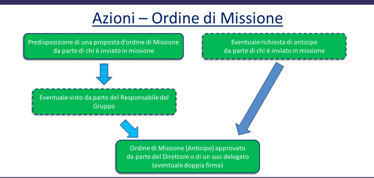
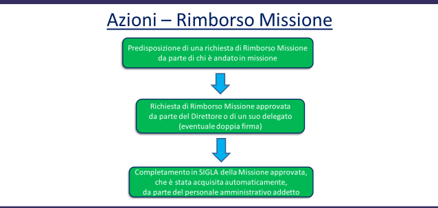

MISSIONI - Piattaforma per la Gestione delle Trasferte
======================================================

Introduzione
------------
La procedura Missioni realizzata per gestire, in maniera automatica e nell’ottica della ‘dematerializzazione dei processi
amministrativi’, l’intero iter relativo alla Richiesta Ordine di Missione, Richiesta di Rimborso e
processo autorizzativo all’interno della Scrivania Digitale sia per quanto riguarda Missioni svolte
in Italia che all’Estero.


La procedura prevede la gestione di:
- Acquisizione dati Personale CNR e Strutture CNR (SIPER-SIGLA)
- Richiesta dell’Ordine di Missione (Missioni);
- Eventuale Richiesta dell’Anticipo relativo (Missioni);
- Processo autorizzativo previsto per l’Ordine di Missione (Scrivania Digitale);
- Richiesta del conseguente Rimborso della Missione (Missioni);
- Processo autorizzativo del Rimborso Missione (Scrivania Digitale);
- Invio automatico dei dati alla procedura Contabile per la liquidazione del rimborso (Sigla);
- Invio automatico dei dati verso la procedura di Rilevazione presenze;

La nuova gestione delle Missioni è stata sviluppata in coerenza con le procedure e la modulistica
previste dal ‘Manuale operativo Le spese di trasferta’ (circolare CNR 29 del 2014 e circolare
CNR 15 del 2014) e si propone di sostituire l’iter cartaceo attuale così riepilogato:

- la compilazione manuale e cartacea dell’Ordine di Missione;
- la presentazione dell’ordine di missione al direttore/delegato per la firma (nel caso di
missione svolta per conto di un’altra U.O. ulteriore invio al direttore/delegato che
autorizza la spesa);
- la protocollazione dell’ordine di missione;
- la compilazione manuale e cartacea della richiesta di rimborso spese missione;
- la presentazione della richiesta di rimborso spese missione con allegati gli scontrini al
direttore/delegato per la firma (nel caso di missione svolta per conto di un’altra U.O.
ulteriore invio al direttore/delegato che autorizza la spesa);
- la protocollazione della richiesta di rimborso spese missione;
- l’inserimento manuale della Missione in SIGLA;

Panoramica
----------
Prima di avviare la gestione automatica delle Missioni bisogna definire, per l’Istituto specifico, i
ruoli autorizzativi previsti attualmente, in coerenza con le scelte messe a disposizione dalla
procedura stessa, in modo da configurare opportunamente l’applicazione. Di seguito lo schema
chiarisce gli attori coinvolti e i ruoli (alcuni istituzionali e altri eventualmente da definire).


Nella figura precedente si individuano:
1. Coloro che possono inserire un ordine di missione e una richiesta di rimborso. Resta inteso
   che, oltre al diretto interessato, l’ordine e il rimborso possono essere inseriti anche da
   una figura amministrativa preposta a tale compito;
2. Il responsabile del Gruppo di ricerca, è una figura che potrebbe non essere presente in
   tutti gli Istituti del CNR. Tale ruolo ha il compito esclusivamente di apporre un visto;
3. La ‘Segreteria’ della Uo di spesa, si può occupare di verificare e/o integrare i dati finanziari
   indicati prima dell’invio alla prima firma di autorizzazione;
4. Il Direttore, ruolo istituzionale, è colui che autorizza attraverso l’accesso alla Scrivania
   Digitale, apponendo la firma digitale. Il Direttore può ‘delegare’ tale compito ad un’altra
   risorsa dell’Istituto;
5. Il personale Amministrativo si può occupare eventualmente di supportare le funzioni del
   Direttore controllando la documentazione, sia dell’ordine che del rimborso, prima
   dell’invio alla firma (Segreterie) e poi successivamente degli aspetti contabili ai fini della
   liquidazione del rimborso missione.

Lo schema seguente chiarisce, rispetto al processo **Proposta di Ordine** di Missione ed eventuali
**Anticipo**, quali azioni sono previste:



Lo schema seguente chiarisce, rispetto al processo **Rimborso Missione**, quali azioni sono
previste:



# _Per avviare una istanza di MISSIONI tramite docker e con h2 in memoria_
```
docker run -p 8080:8080 -e SPRING_PROFILES_ACTIVE=showcase,swagger consiglionazionalericerche/sprint-missioni:latest
```


Collegarsi a http://localhost:8080 username: **_user_** password: **_user_**, oppure come amministratore del sistema, username: **_admin_** password: **_admin_** 

